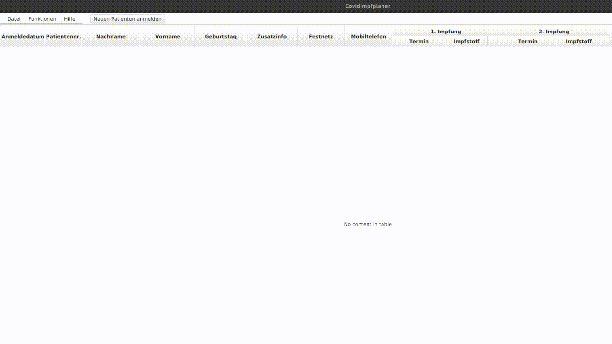
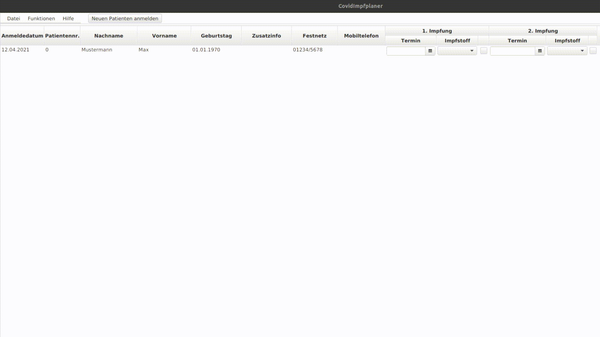
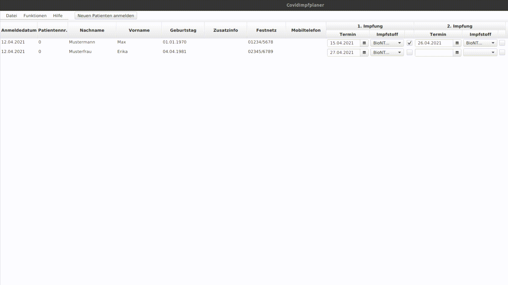
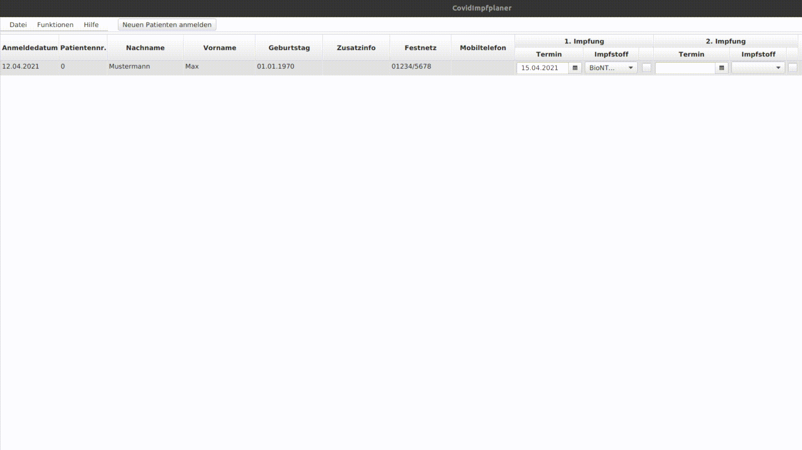
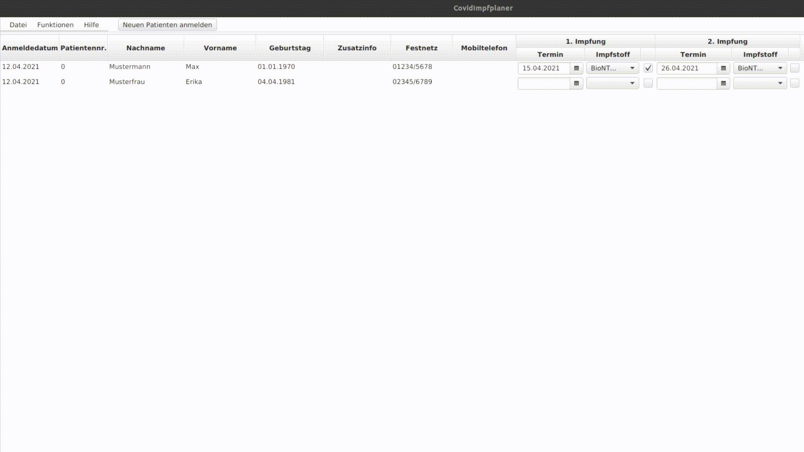
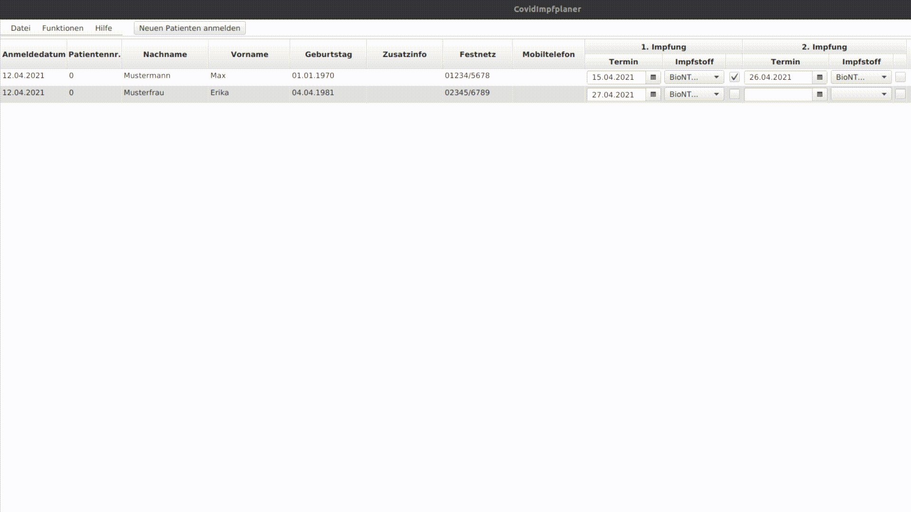

# CovidImpfplaner

Mit Beginn der Impfungen gegen Covid-19 stehen Hausärzte vor organisatorischen
Herausforderungen: Mehrere hundert Patienten melden sich für die Eintragung
in die Impfliste an und müssen bei Verfügbarkeit in der Reihenfolge der
Anmeldung Impftermine erhalten, sobald der Impfstoff verfügbar ist. Bevor
aber Patienten ihre Erstimpfung erhalten, müssen erst die Zweitimpflinge
versorgt werden. Dazu kommen unterschiedliche Impfstoffhersteller mit 
sich ändernden Empfehlungen des Robert-Koch-Instituts. Das reinste Chaos.

Mit dem CovidImpfPlaner will ich es Arztpraxen erleichtern, die Anflut
von **Impfanmeldungen zu bewältigen**, um eine möglichst schnelle Durchimpfung
der Bevölkerung zu erreichen.

## Arbeitsablauf der Arztpraxen beim Impfen

Beim mir bekannten Arbeitsablauf für Covid-19-Impfungen bestellt eine
Arztpraxis ca. eine Woche im Voraus Impfdosen. Ein paar Tage später meldet sich
die Apotheke zurück, wie viele Impfdosen sie tatsächlich liefern kann. Mit
dieser Information rufen die Arztpraxen zuerst die Zweitimpflinge an und
bestellen sie ein. Den übrigen Impfstoff verimpfen sie bei Erstimpflingen.

## Funktionen

Folgende Funktionen werden geboten:
1. Patientendaten hinzufügen: Patienten-ID aus der praxiseigenen Datenbank,
Vor- und Nachname, Geburtsdatum, Telefonnummern, zusätzliches Informationsfeld
für Priorisierung o.ä.

2. Impftermine vereinbaren.

3. Sortierung der Patienten nach verschiedenen Kriterien.

4. Die Mindestbestellmenge für einen wählbaren Zeitraum aus den angemeldeten
Zweitimpflingen bestimmen können.

5. Aus der Rückmeldung der Apotheke über die tatsächlich lieferbaren Impfdosen
die möglichen Erstimpflinge für einen wählbaren Zeitraum berechnen.

6. "Wer kommt wann?" Heraussuchen der Patienten, die einen Termin in einem
vom Benutzer wählbaren Zeitraum haben.

3. Speichern der Anmeldedaten in einer passwortgeschützten Datei (Passwort
wird vom Benutzer beim Speichern festgelegt und muss zum Öffnen erneut
eingegeben werden).

## Anregungen und Support

Für Anregungen zur Verbesserung des Programms bin ich offen!

Der CovidImpfPlaner ist ein Java-Programm, d.h. es funktioniert mit
**Windows**, **Linux** und **MacOS**. Support-Anfragen gerne hier:
pkaesgen(AT)freenet.de

## Lizenz

CovidImpfPlaner  Copyright (C) 2021  Philipp Käsgen
This program is free software: you can redistribute it and/or modify
it under the terms of the GNU General Public License as published by
the Free Software Foundation, either version 3 of the License, or
(at your option) any later version.

This program is distributed in the hope that it will be useful,
but WITHOUT ANY WARRANTY; without even the implied warranty of
MERCHANTABILITY or FITNESS FOR A PARTICULAR PURPOSE.  See the
GNU General Public License for more details.

You should have received a copy of the GNU General Public License
along with this program.  If not, see http://www.gnu.org/licenses.

pkaesgen(AT)freenet.de